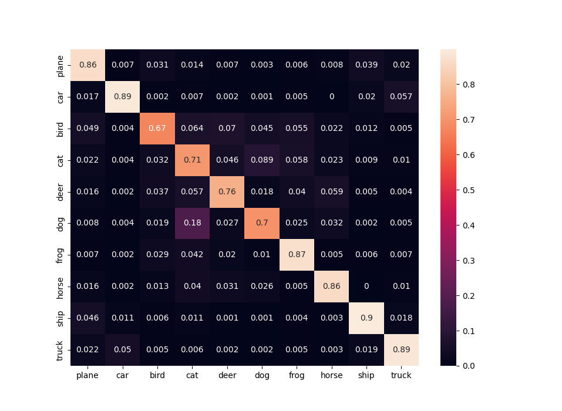
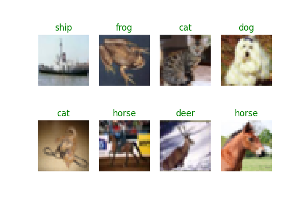

# Cifar10 
Building a Convolutional Neural Network for the cifar10 object recognition dataset as an introductory PyTorch exercise.

## Dataset


CIFAR-10 is a dataset of 60,000 32x32 colour images with 10 classes. Each class has 6,000 labeled images.
The training set contains 50,000 images and the testing set contains 10,000.

### Running the training script
```console
>>> python src/train.py -h
usage: Cifar10 [-h] [--epochs EPOCHS] [--verbose] [--train_path TRAIN_PATH] [--test_path TEST_PATH] [--checkpoints CHECKPOINTS] [--train_batch TRAIN_BATCH] [--test_batch TEST_BATCH] [--learning_rate LR] [--momentum MOMENTUM] [--serialize]

Training a Convolutional Neural Network on the Cifar10 Dataset

options:
  -h, --help            show this help message and exit
  --epochs EPOCHS, --e EPOCHS
                        Number of epochs to train for. Default=15
  --verbose, --v        Print warnings and model training progress
  --train_path TRAIN_PATH
                        The path to the directory in which the Training Dataset will be stored. Default=(./data/)
  --test_path TEST_PATH
                        The path to the directory in which the Testing Dataset will be stored. Default=(./data/)
  --checkpoints CHECKPOINTS
                        The path to which model checkpoints will be saved. Default=(./models/)
  --train_batch TRAIN_BATCH
                        The training batch size
  --test_batch TEST_BATCH
                        The testing batch size
  --learning_rate LR, --lr LR
                        The Learning rate used by the Optimizer. Default=0.001
  --momentum MOMENTUM, --m MOMENTUM
                        The momentum used by SGD/Adam (if used). Default=0.9
  --serialize, --s      Whether or not to save the model to the --checkpoints directory.
```

## Model Architecture
* 6 Convolutional Layers with ReLU activation functions
* 2x2 MaxPooling with a stride of 2
* 3 Fully Connected Linear layers with Dropout (p=0.5)

### In code
The model has 2 primary components. The conv and lin layers. They are defined as:
```python
self.conv = nn.Sequential(
    nn.Conv2d(3, out_channels=64, kernel_size=3, padding=1),
    nn.ReLU(),
    nn.Conv2d(64, out_channels=64, kernel_size=3, padding=1),
    nn.ReLU(),
    nn.MaxPool2d(kernel_size=2, stride=2),
    nn.Conv2d(64, out_channels=128, kernel_size=3, padding=1),
    nn.ReLU(),
    nn.Conv2d(128, out_channels=128, kernel_size=3, padding=1),
    nn.ReLU(),
    nn.MaxPool2d(kernel_size=2, stride=2),
    nn.Conv2d(128, out_channels=256, kernel_size=3, padding=1),
    nn.ReLU(),
    nn.Conv2d(256, out_channels=256, kernel_size=3, padding=1),
    nn.ReLU(),
    nn.MaxPool2d(kernel_size=2, stride=2),
)
# Fully Connected Layers
self.lin = nn.Sequential(
    nn.Linear(4096, 4096),
    nn.ReLU(),
    nn.Dropout(p=0.5),
    nn.Linear(4096, 4096),
    nn.ReLU(),
    nn.Dropout(p=0.5),
    nn.Linear(4096, 10),
)
```

## Results
The model achieved ~81% validation accuracy. It can correctly classify most images, but struggles with certain classes.

## Confusion Matrix
The test script can generate a Confusion Matrix for the model, and display it using Seaborn




### Running the testing script
```console
>>> python src/test.py --model models/trained_model.pt
...
```

will output something analagous to, 

where green indicates a correct classification, and red indicates an incorrect one. 

If you wish to generate the confusion matrix for the model, simply run with the ```--cm``` or ```--confusion``` argument.

```console
>>> python src/test.py --model models/trained_model.pt --confusion
...
```

for information on the cmd line arguments simply use the ```--h``` or ```--help``` arguments

```console
>>> python src/test.py --h
...
usage: Testing a Convolutional Neural Network on CIFAR10 [-h] [--model MODEL] [--test_path TP] [--batch BATCH] [--confusion]

Visualizes the performance of a Convolutional Neural Network on CIFAR10

options:
  -h, --help            show this help message and exit
  --model MODEL         The path to the model
  --test_path TP, --tp TP
                        The path to the testing set from which to take images from
  --batch BATCH         The batch size (default: 8)
  --confusion, --cm     Whether or not to display a Confusion matrix for the model. default: False
>>>
```
